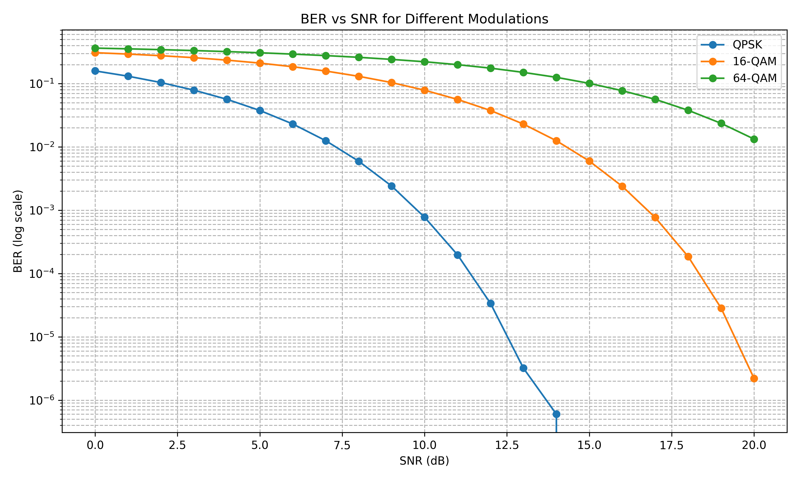

# QAM Modulation Simulator



На графике представлена зависимость Bit Error Rate (BER) от Signal-to-Noise Ratio (SNR) для трёх типов модуляции:
- **QPSK** (Quadrature Phase-Shift Keying) - показывает наилучшую устойчивость к шумам
- **16-QAM** (16-ary Quadrature Amplitude Modulation) - средний баланс между устойчивостью и скоростью
- **64-QAM** - наиболее эффективная по спектру, но требует высокого SNR

Как видно из графика, с увеличением порядка модуляции (QPSK → 16-QAM → 64-QAM) требуется более высокое SNR для достижения того же уровня BER.

## Задание (L1, Физический уровень, Вариант 1)

Проект реализует:
1. **Модулятор QAM** (QPSK, 16-QAM, 64-QAM) - преобразует битовые последовательности в комплексные символы
2. **Канал с AWGN шумом** - добавляет гауссовский шум с заданным SNR
3. **Демодулятор QAM** - восстанавливает битовую последовательность из зашумлённых символов
4. **Анализ BER** - вычисляет вероятность битовой ошибки для разных значений SNR
5. **Визуализацию** - построение графика BER vs SNR

## Сборка и запуск проекта

### Требования
- Компилятор с поддержкой C++17 (GCC, Clang, MSVC)
- CMake (версия 3.12+)
- Python (для визуализации, требует matplotlib)

### Инструкция

1. **Сборка**:
```bash
mkdir build && cd build
cmake .. -DCMAKE_BUILD_TYPE=Release
cmake --build .
```

2. **Запуск симуляции**:
```bash
./QAM_Simulator
```

3. **Генерация графика** (после выполнения программы):
```bash
python visual/plot_results.py
```

Результаты работы:
- `visual/results.csv` - таблица с BER для разных SNR
- `visual/ber_vs_snr.png` - график зависимости BER от SNR

### Структура проекта
```
├── include/               # Заголовочные файлы
│   ├── modulator.hpp
│   ├── demodulator.hpp
│   ├── noise.hpp
│   └── QAMTypes.hpp
├── src/                  # Исходные файлы
│   ├── main.cpp
│   ├── modulator.cpp
│   ├── demodulator.cpp
│   └── noise.cpp
├── visual/               # Результаты и визуализация
│   ├── plot_results.py
│   ├── results.csv
│   └── ber_vs_snr.png
└── CMakeLists.txt        # Файл сборки
```
